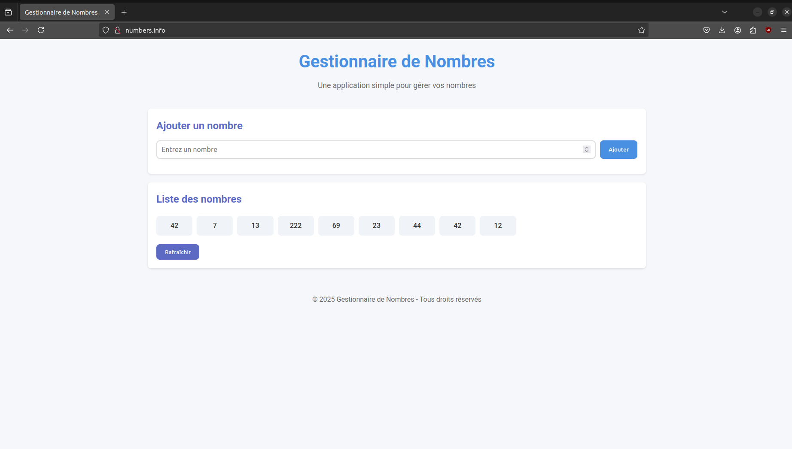

# Application de Gestion de Nombres

## Description du Projet
Cette application permet de gérer une liste de nombres via une interface web moderne. Elle est construite suivant une architecture microservices, utilisant les technologies Docker et Kubernetes.

## Architecture
L'application est composée de trois composants principaux :

### 1. Frontend Service
- **Technologie** : Spring Boot avec HTML/CSS/JavaScript
- **Fonctionnalités** :
  - Interface utilisateur moderne et responsive
  - Formulaire d'ajout de nombres
  - Affichage en temps réel de la liste des nombres
- **Exposition** : NodePort (port 31053)
- **Accès** : Via l'ingress sur `numbers.info`

### 2. Backend Service
- **Technologie** : Spring Boot (Java)
- **Fonctionnalités** :
  - API REST pour la gestion des nombres
  - Persistance des données via MySQL
  - Communication avec la base de données
- **Exposition** : ClusterIP (accès interne uniquement)
- **Endpoints** :
  - GET `/api/numbers` : Liste tous les nombres
  - POST `/api/numbers` : Ajoute un nouveau nombre

### 3. Base de Données
- **Technologie** : MySQL
- **Configuration** :
  - Service : ClusterIP (accès interne uniquement)
  - Persistence des données via Kubernetes Volumes
  - Port : 3306

## Étapes Réalisées

### 1. Service Unique (10/20)
- ✅ Création d'un service backend simple
- ✅ Création du Dockerfile
- ✅ Publication sur Docker Hub
- ✅ Déploiement Kubernetes
- ✅ Configuration du service Kubernetes

### 2. Gateway (12/20)
- ✅ Configuration de l'ingress
- ✅ Routage vers le service via `numbers.info`

### 3. Second Service (14/20)
- ✅ Création du frontend
- ✅ Communication inter-services via REST
- ✅ Déploiement des deux services
- ✅ Configuration du réseau Kubernetes

### 4. Base de Données (16/20)
- ✅ Intégration de MySQL
- ✅ Configuration de la persistance
- ✅ Communication sécurisée backend-DB

## Comment Déployer

1. **Cloner le repository** :
```bash
git clone [URL_DU_REPO]
```

2. **Déployer l'application** :
```bash
./redeploy.sh
```

3. **Accéder à l'application** :
- Ouvrir un navigateur
- Accéder à `http://numbers.info`

## Architecture Technique

```
┌─────────────┐     ┌──────────────┐     ┌─────────────┐
│   Ingress   │────>│   Frontend   │────>│   Backend   │
└─────────────┘     └──────────────┘     └──────┬──────┘
                                                │
                                         ┌──────┴──────┐
                                         │    MySQL    │
                                         └─────────────┘
```

## Technologies Utilisées
- Spring Boot
- Docker
- Kubernetes
- MySQL
- HTML/CSS/JavaScript
- REST API

## Structure du Projet
```
prog-distrib/
├── frontend/                 # Service Frontend
│   ├── src/
│   │   └── main/
│   │       ├── java/        # Code Java
│   │       └── resources/   # Fichiers statiques (HTML, CSS, JS)
│   ├── Dockerfile
│   └── build.gradle
├── backend/                  # Service Backend
│   ├── src/
│   │   └── main/
│   │       ├── java/        # Code Java
│   │       └── resources/   # Configuration
│   ├── Dockerfile
│   └── build.gradle
├── k8s/                     # Configuration Kubernetes
│   ├── frontend/
│   │   ├── deployment.yaml
│   │   └── service.yaml
│   ├── backend/
│   │   ├── deployment.yaml
│   │   └── service.yaml
│   ├── mysql/
│   │   ├── deployment.yaml
│   │   └── service.yaml
│   └── ingress.yaml
└── redeploy.sh             # Script de déploiement

```

## Commandes Utiles

### Surveillance des Services
```bash
# Voir tous les pods
kubectl get pods

# Voir les services
kubectl get services

# Voir les déploiements
kubectl get deployments

# Logs en temps réel
kubectl logs -f <pod-name>
```

### Gestion des Déploiements
```bash
# Redéployer un service
kubectl rollout restart deployment/<deployment-name>

# Vérifier le statut
kubectl rollout status deployment/<deployment-name>
```

## Captures d'écran

### Interface Utilisateur

*Interface web permettant l'ajout et l'affichage des nombres*

### Logs des Services

*Logs du backend montrant les requêtes HTTP et les opérations de base de données*


*Logs du frontend montrant le routage des requêtes et la communication avec le backend*

### Base de Données

*État de la base de données MySQL montrant les nombres stockés*

## Membres de l'Équipe
- Étudiant 1 : Baccouche Ines
- Étudiant 2 : Cherifi Rayan

## Difficultés Rencontrées et Solutions
1. **Configuration de l'Ingress** :
   - Problème : Difficulté initiale avec la résolution DNS
   - Solution : Configuration du fichier hosts et des règles d'ingress

2. **Communication Inter-Services** :
   - Problème : Erreurs CORS et problèmes de routage
   - Solution : Mise en place de @CrossOrigin et configuration des services Kubernetes

3. **Persistance MySQL** :
   - Problème : Perte de données après redémarrage
   - Solution : Configuration des volumes persistants Kubernetes
